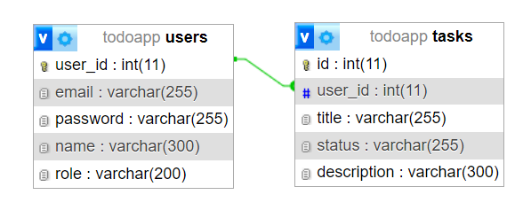

# Task Manager CRUD APP BACKEND

Brief project description.

## Users Routes

### Register a New User

- **Method**: POST
- **URL**: `/user/register`
- **Description**: Register a new user.
- **Body**:
  - name: String
  - email: String
  - password: String (hashed securely using bcrypt)
  - role: String
- **Response**:
  - message: 'User created successfully'

### Login to the System

- **Method**: POST
- **URL**: `/user/login`
- **Description**: Login to the system.
- **Body**:
  - email: String
  - password: String
- **Response**:
  - message: "Login successful"
  - token: <JWT Token>

### Update a User

- **Method**: PUT
- **URL**: `/user/:user_id`
- **Description**: Update a user.
- **Body**:
  - name: String
  - email: String
  - password: String (hashed securely using bcrypt)
  - role: String
- **Response**:
  - message: 'User updated successfully'

### Delete a User

- **Method**: DELETE
- **URL**: `/user/:user_id`
- **Description**: Delete a user.
- **Response**:
  - message: 'User deleted successfully'

### Get all Users

- **Method**: GET
- **URL**: `/user`
- **Description**: Get all user.
- **Response**:
  - get all users json file

## Tasks Routes

### Get all Tasks

- **Method**: GET
- **URL**: `/tasks`
- **Description**: Get all task.
- **Response**:
  - task json file

### Get a Task by Id

- **Method**: GET
- **URL**: `/tasks/:id`
- **Description**: Get a task by ID
- **Response**:
  - tasks json file

### Add Task

- **Method**: POST
- **URL**: `/tasks`
- **Description**: Add Task.
- **Body**:
  - title: String
  - description: String
  - status: String 
- **Response**:
  - message: 'Task added successfully'

### Update Task

- **Method**: PUT
- **URL**: `/tasks/:id`
- **Description**: Update Task.
- **Body**:
  - title: String
  - description: String
  - status: String 
- **Response**:
  - show updated task in json file

### Delete Task

- **Method**: DELETE
- **URL**: `/tasks/:id`
- **Description**: Delete Task.
- **Body**:
  - title: String
  - description: String
  - status: String 
- **Response**:
  - message: 'Task deleted successfully'

## Database Schema

Description of your database schema.

### Users Table

- user_id: INT (Primary Key)
- name: VARCHAR
- email: VARCHAR
- password: VARCHAR (hashed)
- role: VARCHAR

### Tasks Table

- id: INT (Primary Key)
- title: VARCHAR
- description: VARCHAR
- status: VARCHAR
- user_id: INT (Foreign Key referencing Users Table)

## Technologies Used

- Node.js
- MySQL
- JWT (JSON Web Token)
- Bcrypt (for password hashing)
- Express.js (for routing)

## Setup Instructions

1. Clone the repository.
2. Install dependencies (`npm install`).
3. Set up the database.
4. Run the application (`npm run start`).

## Author

MD.Farzine Hossen

